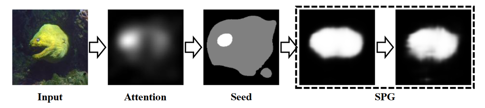
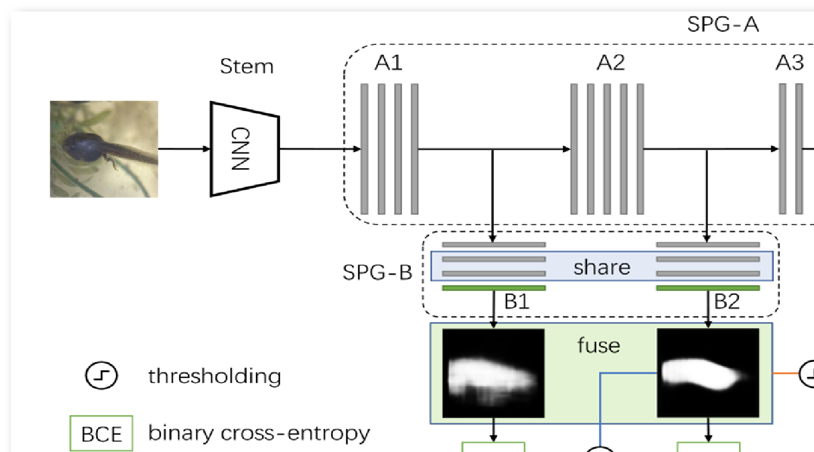
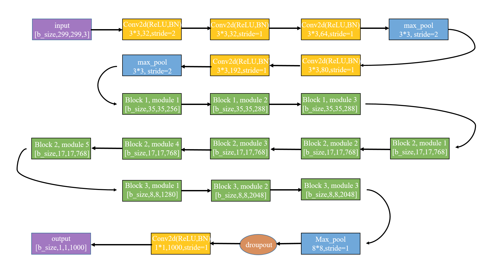

# Self-produced Guidance for Weakly-supervised Object Localization
一篇使用self-produced guidance来实现弱监督目标定位的文章。
这篇文章发表在ECCV2018上，作者是悉尼科技大学博士，现在在UIUC伊利诺伊大学香槟分校魏云超组里交流。

# SPG
弱监督的方法大多是基于分类网络生成的attention maps来做的定位，
然而attention maps只关注了图像中的一些小的并且有判别性的部分，
不是整个物体的完整区域。
论文中提出了一种generate Self-produced Guidence(SPG) masks，
将物体从背景中分离出来来提供给分类网络一些像素之间的空间关联信息。
SPG方法呢是一个分阶段的方法，它结合高置信度的物体区域学习SPG masks，
并用来作为辅助的监督信息来促进分类网络的训练。

如上图所示，给定一张图片，先根据分类网络生成attention maps，
然后根据attention maps的置信度将其分成对象、背景和未定义的区域三部分Seed，
其中具有中等置信度的未定义区域意味着这部分区域需要使用中间层的特征来弄清楚。怎么弄清楚呢？
文中使用了一种top-down机制，使用高层的输出作为底层的监督来学习物体的位置信息。
上层包含更多的抽象的语义信息，而底层有一些更加具体的pixel-related信息。

所以，整个这个SPGmask就是由这三部分seeds作为监督信息得到的多阶段的像素级的对象mask。

# 网络结构

如图所示，网络由Stem，SPG-A，B，C四部分组成。
其中，Stem和A1、A2部分来自Inception-V3结构，移除了Block3及以后的层。

A3部分是新添加上的两个卷积层，kernel_size=3，strides=1,pad=1 with 1024 fileters。
A4部分是一个1×1的卷积，stride=1 with 1000 units。最后是一层GAP。
这就是用的ACoL那一篇论文的方法，在前向传播中得到类激活图。
接下来这个激活图就根据两个阈值被分为三种，分别是前景，背景，和不知道的区域。灰色的就是不知道的区域。就得到了种子。

SPG-B利用种子作为监督来学习SPG masks。就是渐渐的吧这个灰色的区域给他分类。我们可以注意到A1，A2的输出也被用到了。这就是说的利用中间层的特征来帮助分类未定义的区域。
SPG-B呢有两块，每一块都有三层，第一层用来适应A1，A2不同的输出，所以他们的卷积核数量是不相同的。
B1和B2的第一层是3×3的卷积层with 288 and 768 filters, respectively.第二层是512 filters的卷积层，第三层是1×1的输出层。其中，B1和B2的第二、三层共享权重。

整个过程就是：根据这个种子做监督，B2块得到了这样一个mask, 而B1根据B2得到的mask做监督呢又可以得到更好的mask. 最后两个mask，取均值得到了最后的mask.

SPG-C是由两个3×3的卷积层with 512 filters 和一层1×1的输出层组成。
SPG-C用来给网络注入pixel-level的feedback信息，也就是piexl-level的监督信息，让网络同时学习classification和silency 
